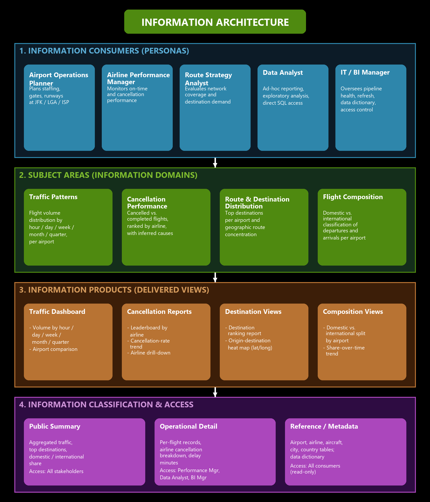
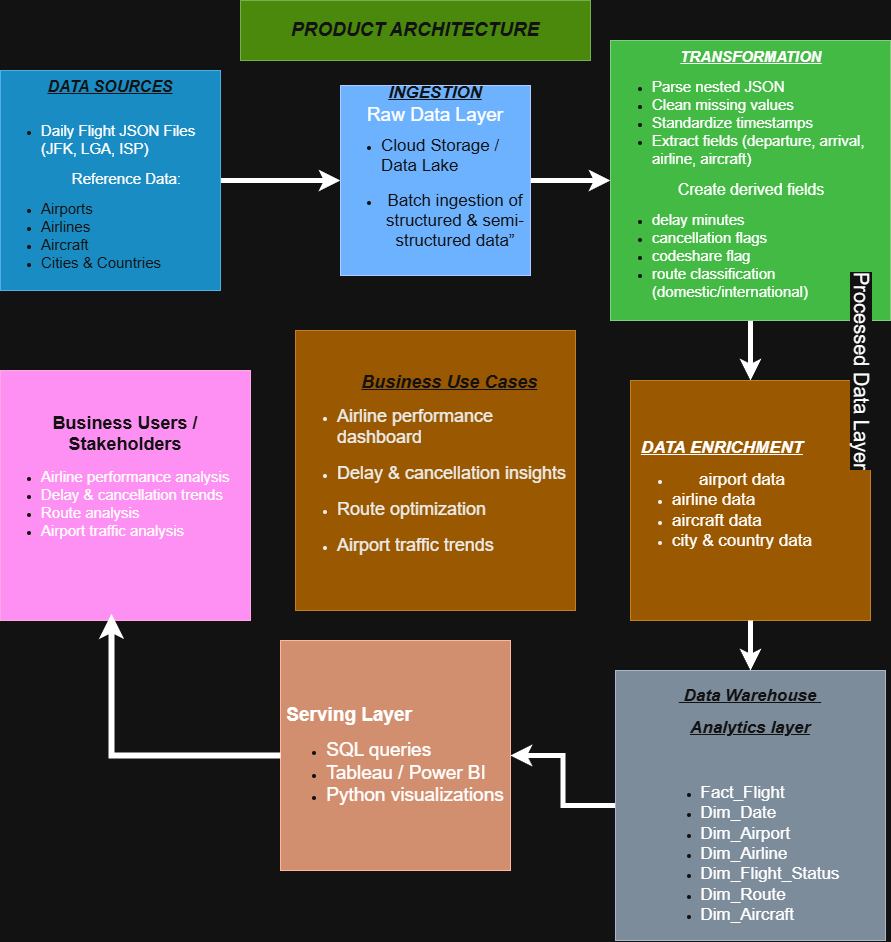
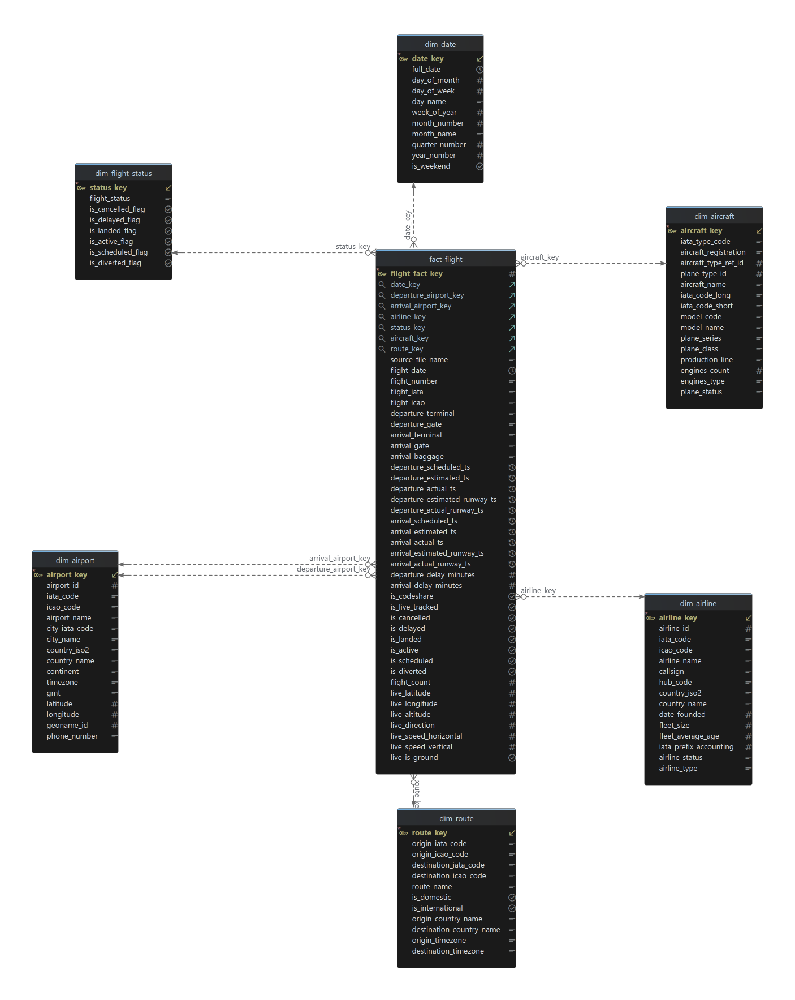
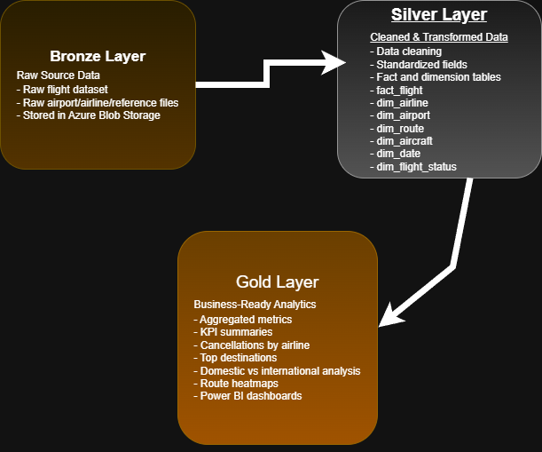
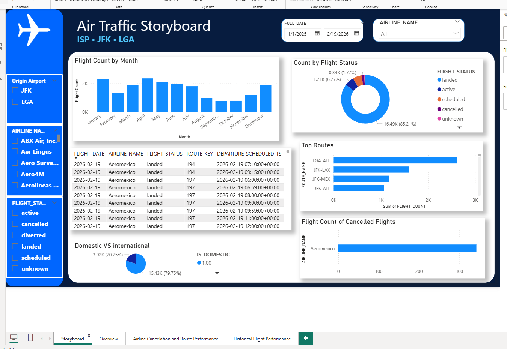
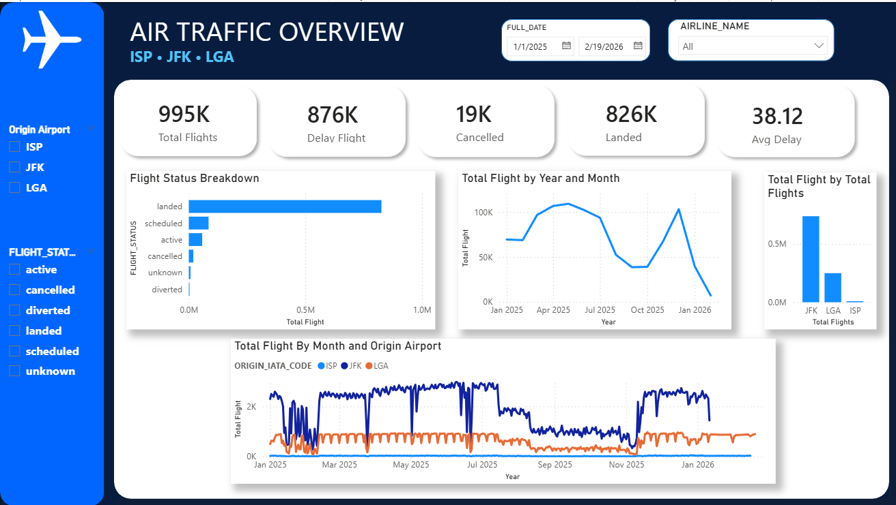
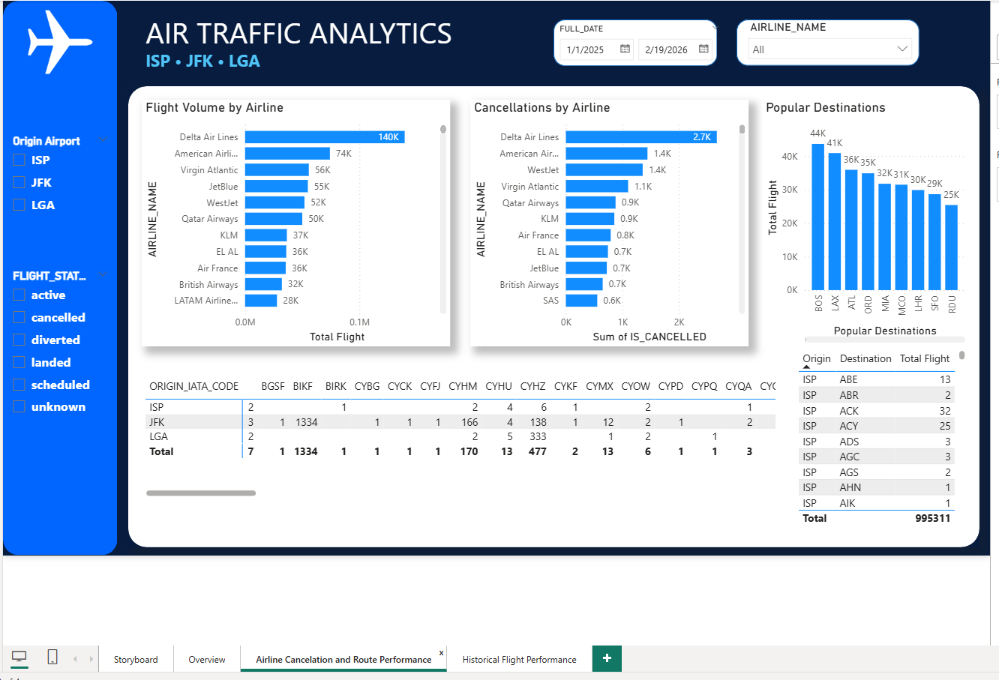
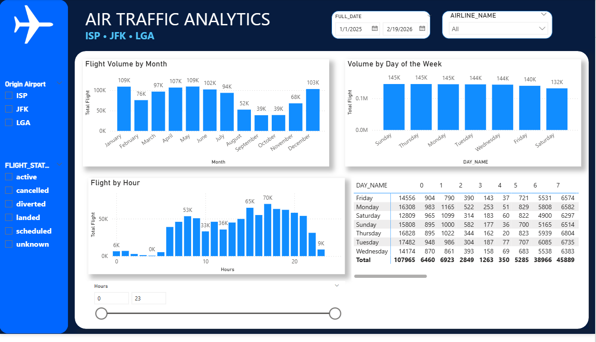

# Project Readme

## A. Problem Context
Aviation is one of the most data-intensive industries, with thousands of flights operating daily across hundreds of airports. Airlines, airport authorities, and regulators need reliable insights into air traffic patterns, flight cancellations, and route distributions to optimize operations, improve customer experience, and reduce costs.

This project focuses on building a data warehouse solution to analyze air traffic data for three major New York area airports: ISP (Long Island MacArthur Airport), JFK (John F. Kennedy International Airport), and LGA (LaGuardia Airport). By analyzing traffic patterns, cancellation trends, and route information, stakeholders can make data-driven decisions to improve airline operations and passenger satisfaction.

## B. Requirements

### 1. Requirements Analysis
- Business Personas
  - List the key stakeholders and their roles.
  - Example:
    - Data Analyst: Responsible for data analysis and reporting.
    - IT Manager: Oversees technical implementation.
- Risks
  - Data quality issues (missing fields, inconsistent formats in the provided dataset).
  - The Aviationstack API is expensive, so the project relies on a professor-provided dataset which may have limited coverage.
  - Cancellation reason data is not included in the dataset; external research is required to infer causes.
  - Team coding experience ranges from beginner to intermediate, which may slow development.
- Costs
  - Estimate the costs associated with the project.
    - Software licenses: $0
    - Real costs: $0
    - The project will utilize open source tools like python, pandas, numpy, and Apache Airflow for ETL, orchestration, and data analysis. Tableau Desktop is free for students through the Tableau for Students program using a Baruch .edu email, so no visualization licensing fees are required.
    - Optional Cost: $0-$70/month
    - In a production-level scenario we could use paid versions such as Tableau Creator at $70 per month, or a managed orchestration service like Google Cloud Composer; these are not needed for this project.
    - Data source costs: $0
    - The flight data is sourced from the Aviationstack database but is provided as a static JSON file by the professor, so there are no API subscription costs for the team. If we were to pull directly from the Aviationstack API instead, the Basic plan would cost about $50 per month for 10,000 requests, but we do not need this.
    - Cloud infrastructure costs: $0
    - The project uses Google Cloud Storage (GCS) for raw and staged data, and Google BigQuery as the data warehouse. Both fit within the GCP free tier for our expected data volume (roughly tens of GB of storage and well under 1 TB of queries per month), so no cloud costs are incurred.
    - Hardware upgrades: $0-$250+
    - If the project is running on a personal computer that meets the 8GB ram and 100gb storage than the costs are free assuming we already have these computers, but hypothetically if we didnt have these we would be looking at a fixed cost of $250 or more if we were to buy a computer for this project.
- Timeline
  - Phase 1: Requirements Gathering, Cost/Benefits/Risks, Architecture — February 28, 2026
  - Phase 2: Data Modeling — March 14, 2026
  - Phase 3: Data Pipeline Started — March 28, 2026
  - Phase 4: Data Pipeline Midway — April 11, 2026
  - Phase 5: Visualization Started — April 25, 2026
- Benefits
  - Identify peak traffic periods (by hour, day, week, month, quarter) for better resource planning.
  - Pinpoint airlines with the highest cancellation rates and suggest actionable improvements.
  - Visualize the most popular flight destinations via heat maps for route optimization.
  - Distinguish domestic vs. international flight volumes to understand airport utilization.

### 2. Business Requirements
- Analyze air traffic patterns of ISP, JFK, and LGA.
- Identify the most frequent flight destinations from each airport.
- Determine whether traffic follows a uniform or normal distribution pattern.
- Analyze domestic flight vs. international flight volumes.

### 3. Functional Requirements
- Track cancelled flights by airline (cancelled vs. non-cancelled).
- Identify the airline with the most cancellations.
- Provide recommendations to reduce flight cancellations.
- Generate traffic pattern reports filterable by hour, day, week, month, and quarter.
- Display a heat map showing the concentration of flight destinations.
- Classify and count domestic vs. international flights.

### 4. Data Requirements
- Structured flight data provided by the professor (sourced from the Aviationstack database).
- Reference data for airports (airport codes, names, locations with latitude/longitude for heat maps).
- External research data on flight cancellation causes (to supplement the dataset, which does not include cancellation reasons).

## C. Architecture

### 1. Information Architecture
- 

### 2. Data Architecture
- Describe the structure and flow of the data.
- Include diagrams or images if necessary. 
  - 

### 3. Technical Architecture
- 
### 4. Product Architecture  
- Provide an overview of the product's overall structure.
- Include any major components and how they interact.
- 
## D. Modeling

### 1. Dimensional Modeling

In this project  we used a star schema dimensional model to organize the flight data for analytics. The central fact table is `fact_flight`, which stores the measurable flight activity records. The fact table connects to several dimension tables that describe the date, airports, airline, aircraft, route, and flight status.

  - 
    
### Fact Table

#### `fact_flight`

The `fact_flight` table is the center of the model and represents individual flight records. Each row contains flight-level information such as the flight date, airline, departure airport, arrival airport, aircraft, route, and flight status. It also includes operational fields such as scheduled, estimated, and actual departure and arrival times, delay minutes, cancellation flags, delay flags, landed flags, and live flight tracking fields.

The fact table contains foreign keys that connect to the dimension tables:

- `date_key`  to `dim_date`
- `departure_airport_key`  to `dim_airport`
- `arrival_airport_key`  to `dim_airport`
- `airline_key`  to `dim_airline`
- `status_key`  to `dim_flight_status`
- `aircraft_key` conects to `dim_aircraft`
- `route_key`  to `dim_route`

### Dimension Tables

#### `dim_date`

The `dim_date` table allows for time related analysis. It includes full date, day of month, day of week, day name, week of year, month number, month name, quarter number, year number, and weekend indicator. This allows users to analyze flight patterns by day, month, quarter, year, and weekend vs. weekday.

#### `dim_airport`

The `dim_airport` table stores airport reference information. It includes airport ID, IATA code, ICAO code, airport name, city, country, continent, timezone, GMT offset, latitude, longitude, and phone number. This dimension is used twice in the fact table, once for the departure airport and once for the arrival airport.

#### `dim_airline`

The `dim_airline` table stores airline information such as airline ID, IATA code, ICAO code, airline name, callsign, hub code, country, founding date, fleet size, average fleet age, IATA prefix accounting, airline status, and airline type. This supports airline level analysis such as flight volume and cancellation performance by airline.

#### `dim_flight_status`

The `dim_flight_status` table stores the flight status category and related status flags. It includes the status key, flight status, cancellation flag, delayed flag, landed flag, active flag, scheduled flag, and diverted flag. This allows the dashboard to compare cancelled, landed, active, scheduled, delayed, and diverted flights.

#### `dim_aircraft`

The `dim_aircraft` table stores aircraft and airplane reference data. It includes aircraft key, IATA type code, aircraft registration, aircraft type reference ID, plane type ID, aircraft name, IATA codes, model code, model name, plane series, plane class, production line, engines count, engines type, and plane status. This allows flight activity to be analyzed by aircraft type and model.

#### `dim_route`

The `dim_route` table stores origin-destination route information. It includes route key, origin IATA code, origin ICAO code, destination IATA code, destination ICAO code, route name, domestic flag, international flag, origin country name, destination country name, origin timezone, and destination timezone. This dimension supports route analysis, top destination analysis, and domestic vs. international flight comparisons.

### Relationships

The dimensional model follows a one-to-many relationship structure. Each dimension table has one record per descriptive entity, while the `fact_flight` table can contain many flight records connected to those dimensions.

Examples:

- One date can relate to many flights.
- One airline can operate many flights.
- One airport can appear in many departure and arrival records.
- One aircraft can be connected to many flights.
- One route can appear in many flight records.
- One flight status can describe many flights.

This model allows Power BI users to filter and analyze flight data across time, airports, airlines, aircraft, routes, and statuses.

## 2. Medallion Architecture

The project uses a Medallion Architecture to organize the flight data pipeline into three layers: Bronze, Silver, and Gold. This structure separates raw data storage, cleaned/transformed data, and business-ready analytics outputs.

### Bronze Layer: Raw Data

The Bronze layer has the original source data exactly as it was taken. This includes the raw flight dataset and reference files such as airports, airlines, aircraft, cities, and countries. These files are stored in cloud storage as the stage before any cleaning or transformation is done

[RAW DATA](Raw_data)

### Silver Layer: Cleaned and Transformed Data

The Silver layer has cleaned, standardized, and structured data. In this stage, the raw data is transformed into a dimensional model. Cleaning steps include standardizing column names, converting data types, handling missing values, creating surrogate keys, and separating the data into fact and dimension tables.

[CLEANED DATA](Project_Data)

### Gold Layer: Business-Ready Analytics

The Gold layer represents the final reporting and analytics layer. This includes aggregated metrics, dashboard-ready outputs, and Power BI visualizations used to answer the project’s business questions.

[ANALYTICS AND VISUALS](DashBoard)

  - 

## E. Methodology and Implementation

### Approach

The project follows a phased delivery approach structured around the milestones set by the professor. Each phase produced concrete deliverables that fed directly into the next.

### Phases

- Phase 1 (Feb 28, 2026): requirements gathering, cost, benefits, risks, and architecture diagrams.
- Phase 2 (Mar 14, 2026): dimensional modeling. Fact_Flight and six dimensions authored in DbSchema.
- Phase 3 (Mar 28, 2026): data pipeline started. Python ETL notebook for JSON ingestion and the raw-to-cleaned flight DataFrame.
- Phase 4 (Apr 11, 2026): data pipeline midway. Dimension tables and Fact_Flight assembled with surrogate keys; CSV outputs committed.
- Phase 5 (Apr 25, 2026): warehouse provisioning and visualization. Curated tables staged to Azure Blob Storage, loaded into Snowflake, and visualized in Power BI.

### Pipeline

A Python notebook performs the full ETL: it reads the raw Aviationstack JSON and reference CSVs, transforms them in memory, and writes the curated fact table and six dimension tables as CSVs. The CSVs are uploaded to Azure Blob Storage, which serves as the cloud staging layer between local output and the warehouse. From Azure, Snowflake ingests them via an External Stage and `COPY INTO`, populating the star schema. Power BI Desktop then connects to Snowflake through the native connector in Import mode, materializes the tables into the `.pbix` workbook, and authors the four dashboard pages exported under `DashBoard/`.

Because all transformation runs in pandas before the warehouse load, the pipeline is ETL, not ELT. Snowflake ingests pre-curated data without performing any transformation. ELT was not adopted because the source data requires nested JSON flattening, multi-source enrichment, and surrogate-key assignment that are more naturally expressed in pandas than in SQL.

### Tools

- Transformation: Python 3, Jupyter Notebook, pandas, numpy — the ETL engine.
- Staging: Azure Blob Storage — cloud staging tier between ETL output and the warehouse.
- Warehouse: Snowflake — hosts the star schema and serves data to BI tools.
- Visualization: Power BI Desktop — connects to Snowflake in Import mode; the `.pbix` workbook is shared via SharePoint.
- Modeling and documentation: DbSchema (ER diagram), draw.io (architecture diagrams), Git and GitHub (version control).

The pipeline is currently executed manually. Managed orchestration tools such as Azure Data Factory or Snowflake Tasks are referenced as production-scale equivalents but are out of scope for the present implementation.

## F. Visualization

The final interface for the project was developed in Power BI. The dashboard lets users analyze flight traffic at ISP, JFK, and LGA through various filtering options such as airport, carrier, flight status, date, and time range.
The dashboard was divided into four main report pages which are:

### 1. Dashboard Storyboard

The storyboard page shows the user flow of the dashboard. beginning with filters for origin airport, airline, flight status, and date. The visuals then update to show flight volume by month, flight status breakdown, top routes, cancelled flights, domestic vs. international flights, and flight-level detail records.

### 2. Air Traffic Overview

The overview page gives a summary of the flight dataset. It includes KPI cards for total flights, delayed flights, cancelled flights, landed flights, and average delay. It also includes charts for flight status breakdown, total flights by year/month, total flights by airport, and monthly flight trends by airport.

### 3. Airline Cancellation and Route Performance

This page focuses on airline and route analysis. It compares flight volume by airline, cancellations by airline, popular destinations, and origin-destination route performance. This page supports the project requirement to track cancelled flights by airline and identify high-volume routes.

### 4. Historical Flight Performance

This page analyzes time-based flight patterns. It shows flight volume by month, day of week, and hour. These visuals help show peak periods and support resource planning for airports and airlines.

## G. Insights
Highlight any key insights gained from the project.

The Dash Board from Power BI dashboard shows us a lot of important patterns in our data such as:

1. The JFK airport has the highest number of flights compared to the other two airports. From the overview of the dashboard, the JFK airport has the highest number of total flights, followed by the LGA airport, whereas the ISP airport has very few flights. Therefore, it can be concluded that the JFK airport is the main airport in terms of the number of flights.

2. The majority of flights are  'landed'. A break-down of the status of flights shows that majority of the flights were successful. The 'landed' category has the most flights in the data set, whereas 'cancelled', 'diverted', and 'unknown' have fewer flights compared to others.

3. There is variation of flight volume from month to month. Flight volume is highest in April and May, where both have approximately 109k flights, and lowest in September and October, where both have approximately 39k flights each.

4. The level of flight activity is maximum during the afternoon and evening period.
As depicted by the hourly graph, flight traffic increases steadily through the day and reaches its peak during the late afternoon/early evening time. The highest number of flights occurs during hour 17 with nearly 70K flights.

5. Sundays, Thursdays, and Mondays have the highest traffic volume.
The graph for daily variation indicates Sundays, Thursdays, and Mondays having the same number of flights, i.e., approximately 145K flights. Saturdays have the lowest volume, approximately 132K flights.

6. Delta Air Lines is the airline with the greatest number of flights.
Delta Air Lines is shown on the airlines performance graph as having almost 140k flights, thus being the airline with the greatest number of flights in the dataset.

7. Delta Air Lines is also the airline with the greatest number of cancellations.
According to the graph for the total cancellations, Delta Air Lines has almost 2.7k cancellations, while American Airlines and WestJet have 1.4k cancellations each.

8. The most frequent destination is BOS.
On the popular destinations chart, BOS is shown as the destination with almost 44k flights, with LAX and ATL following as the second and third destinations, with 41k 

9. Most are domestic flights. The domestic versus international chart clearly reveals that approximately 79.75% are domestic flights, whereas approximately 20.25% are international flights. It implies that the data set comprises mostly domestic air traffic within the United States.

## H. Conclusion

The data warehouse and analytics system have been effectively implemented to analyze data on aviation in relation to ISP, JFK, and LGA in this project. The data were processed using a dimensional modeling strategy in which facts and dimensions were extracted from the source data and then fed into Power BI to generate visualizations. The dashboard developed in this study enables users to assess total flight volume, flight status, cancellations per airline, top destinations, route activity, and historical flight traffic. This information can be valuable for making decisions regarding flight traffic and cancellations at airports. Further developments may involve connecting to the live Aviationstack API, integrating weather data, integrating cancellation cause data, and even building prediction models for delays and cancellations.

## I. References
- Provide a list of all references used in the project, formatted according to MLA style.

1. Baruch College. CIS4400 Aviation Flight Dataset (2025). Google Cloud Storage, 2025, https://console.cloud.google.com/storage/browser/msba-online-data/CIS4400/project04/2025.
2. Aviationstack API Documentation. APILayer, 2026, https://docs.apilayer.com/aviationstack/docs/api-documentation.
3. Microsoft Azure Documentation. Microsoft, 2026, https://learn.microsoft.com/en-us/azure/.
4. Snowflake Documentation. Snowflake Inc., 2026, https://docs.snowflake.com/.
5. CIS4400 Group 4 Aviation Data Warehouse Project. GitHub, 2026, https://github.com/nakagami-306/CIS4400-Group-4.
6. FLIGHTS_DB_PNG (Dimensional Model Diagram). GitHub, 2026, https://github.com/nakagami-306/CIS4400-Group-4/blob/main/Dimensional_modeling/FLIGHTS_DB_PNG.png.
7. Information Architecture Diagram. GitHub, 2026, https://github.com/nakagami-306/CIS4400-Group-4/blob/main/Architectures/INFOARCH.drawio.png.
8. Data Architecture Diagram. GitHub, 2026, https://github.com/nakagami-306/CIS4400-Group-4/blob/main/Architectures/DATAARCH.drawio.png.
9. Technical Architecture Diagram. GitHub, 2026, https://github.com/nakagami-306/CIS4400-Group-4/blob/main/Architectures/TECHARCH-Page-3.jpg.
10. Product Architecture Diagram. GitHub, 2026, https://github.com/nakagami-306/CIS4400-Group-4/blob/main/Architectures/PRODUCT_ARCH.drawio.png.
11. Cleaned_Flight_Data (2) Jupyter Notebook. GitHub, 2026, https://github.com/nakagami-306/CIS4400-Group-4.
12. Flight Analysis Power BI Dashboard (.pbix). Microsoft Power BI / SharePoint, 2026, https://cuny907-my.sharepoint.com/.
13. Flight Analysis Dashboard Storyboard and Architecture Presentation. Canva, 2026, https://canva.link/vkpmx3ei5ruxk0x.
---

*Replace placeholders like "path_to_image" with actual file paths or URLs.*
