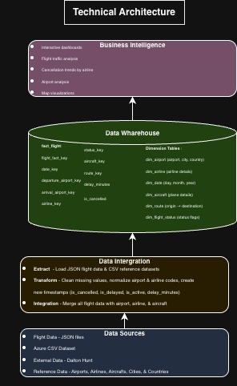

# Project Readme

## A. Problem Context
Aviation is one of the most data-intensive industries, with thousands of flights operating daily across hundreds of airports. Airlines, airport authorities, and regulators need reliable insights into air traffic patterns, flight cancellations, and route distributions to optimize operations, improve customer experience, and reduce costs.

This project focuses on building a data warehouse solution to analyze air traffic data for three major New York area airports: ISP (Long Island MacArthur Airport), JFK (John F. Kennedy International Airport), and LGA (LaGuardia Airport). By analyzing traffic patterns, cancellation trends, and route information, stakeholders can make data-driven decisions to improve airline operations and passenger satisfaction.

## B. Requirements

### 1. Requirements Analysis
- Business Personas
  - List the key stakeholders and their roles.
  - Example:
    - Data Analyst: Responsible for data analysis and reporting.
    - IT Manager: Oversees technical implementation.
- Risks
  - Data quality issues (missing fields, inconsistent formats in the provided dataset).
  - The Aviationstack API is expensive, so the project relies on a professor-provided dataset which may have limited coverage.
  - Cancellation reason data is not included in the dataset; external research is required to infer causes.
  - Team coding experience ranges from beginner to intermediate, which may slow development.
- Costs
  - Estimate the costs associated with the project.
    - Software licenses: $0
    - Real costs: $0
    - The project will utilize open source tools like python, pandas, numpy, and Apache Airflow for ETL, orchestration, and data analysis. Tableau Desktop is free for students through the Tableau for Students program using a Baruch .edu email, so no visualization licensing fees are required.
    - Optional Cost: $0-$70/month
    - In a production-level scenario we could use paid versions such as Tableau Creator at $70 per month, or a managed orchestration service like Google Cloud Composer; these are not needed for this project.
    - Data source costs: $0
    - The flight data is sourced from the Aviationstack database but is provided as a static JSON file by the professor, so there are no API subscription costs for the team. If we were to pull directly from the Aviationstack API instead, the Basic plan would cost about $50 per month for 10,000 requests, but we do not need this.
    - Cloud infrastructure costs: $0
    - The project uses Google Cloud Storage (GCS) for raw and staged data, and Google BigQuery as the data warehouse. Both fit within the GCP free tier for our expected data volume (roughly tens of GB of storage and well under 1 TB of queries per month), so no cloud costs are incurred.
    - Hardware upgrades: $0-$250+
    - If the project is running on a personal computer that meets the 8GB ram and 100gb storage than the costs are free assuming we already have these computers, but hypothetically if we didnt have these we would be looking at a fixed cost of $250 or more if we were to buy a computer for this project.
- Timeline
  - Phase 1: Requirements Gathering, Cost/Benefits/Risks, Architecture — February 28, 2026
  - Phase 2: Data Modeling — March 14, 2026
  - Phase 3: Data Pipeline Started — March 28, 2026
  - Phase 4: Data Pipeline Midway — April 11, 2026
  - Phase 5: Visualization Started — April 25, 2026
- Benefits
  - Identify peak traffic periods (by hour, day, week, month, quarter) for better resource planning.
  - Pinpoint airlines with the highest cancellation rates and suggest actionable improvements.
  - Visualize the most popular flight destinations via heat maps for route optimization.
  - Distinguish domestic vs. international flight volumes to understand airport utilization.

### 2. Business Requirements
- Analyze air traffic patterns of ISP, JFK, and LGA.
- Identify the most frequent flight destinations from each airport.
- Determine whether traffic follows a uniform or normal distribution pattern.
- Analyze domestic flight vs. international flight volumes.

### 3. Functional Requirements
- Track cancelled flights by airline (cancelled vs. non-cancelled).
- Identify the airline with the most cancellations.
- Provide recommendations to reduce flight cancellations.
- Generate traffic pattern reports filterable by hour, day, week, month, and quarter.
- Display a heat map showing the concentration of flight destinations.
- Classify and count domestic vs. international flights.

### 4. Data Requirements
- Structured flight data provided by the professor (sourced from the Aviationstack database).
- Reference data for airports (airport codes, names, locations with latitude/longitude for heat maps).
- External research data on flight cancellation causes (to supplement the dataset, which does not include cancellation reasons).

## C. Architecture

### 1. Information Architecture
- 

### 2. Data Architecture
- Describe the structure and flow of the data.
- Include diagrams or images if necessary. 
  - 

### 3. Technical Architecture
- 

### 4. Product Architecture  
- Provide an overview of the product's overall structure.
- Include any major components and how they interact.
- 
## D. Modeling

### 1. Dimensional Modeling
- Explain the dimensional modeling
- Example:
  - **Facts**: describe all the facts
  - **Dimension**: include all dimensions

*Include any necessary images or diagrams to clarify the architecture.*
  - 

### 2. Medallion Architecture
- Explain the medallion architecture and its stages: Bronze, Silver, Gold.
- Example:
  - **Bronze**: Raw, unprocessed data
  - **Silver**: Cleaned and enriched data
  - **Gold**: Aggregated, ready-for-use data

  

## E. Methodology and Implementation

### Approach

The project follows a phased delivery approach structured around the milestones set by the professor. Work was organized as a sequence of fixed-scope phases rather than time-boxed Agile sprints, with each phase producing concrete deliverables that fed directly into the next phase.

### Phases

- Phase 1 (target Feb 28, 2026): requirements gathering, cost, benefits, risks, and architecture. The team delivered the problem context, business, functional, and data requirements, and the Information, Data, Technical, and Product architecture diagrams.
- Phase 2 (target Mar 14, 2026): data modeling. The dimensional model with Fact_Flight and six dimensions was authored in DbSchema as `FLIGHT_DBS_FINAL.dbs` and exported as the ER diagram `FLIGHTS_DB_PNG.png`.
- Phase 3 (target Mar 28, 2026): data pipeline started. The initial ETL notebook handles JSON ingestion from `flightdata.zip`, reference CSV loading, and the raw-to-cleaned flight DataFrame.
- Phase 4 (target Apr 11, 2026): data pipeline midway. Dimension tables for Date, Airport, Airline, Flight_Status, Aircraft, and Route were constructed, and Fact_Flight was assembled with surrogate keys. Dimension outputs were committed under `Project_Data/dim_*.xls`.
- Phase 5 (target Apr 25, 2026): visualization started, in progress. Tableau dashboards on traffic patterns, cancellations, route distribution, and domestic vs. international composition are planned. Workbooks have not yet been committed at the time of writing.

### Metadata Management

The Data Dictionary covers every column of the flight fact and all six dimension tables, with column name, data type, description, and constraints or nullability. It is maintained in [`Data_Dictionary/Data_Dictionary_Flight.pdf`](Data_Dictionary/Data_Dictionary_Flight.pdf).

Source data is provided externally by the professor as the `flightdata.zip` archive and six reference CSV files. These files are not committed to the repository; the ETL notebook expects them in the working directory at run time.

Per-day Aviationstack JSON files inside `flightdata.zip` are flattened into Fact_Flight, Dim_Flight_Status, and Dim_Date. The flattening unpacks the nested departure, arrival, airline, flight, aircraft, and live objects, and derives delay minutes, cancellation, delayed, landed, active, scheduled, and diverted flags, plus the codeshare flag.

The six reference CSVs feed the dimensions as follows. `CIS4400_project08_references_airports.csv` populates Dim_Airport, normalizing IATA and ICAO codes and attaching city, country, latitude, longitude, timezone, and GMT offset. `CIS4400_project08_references_airlines.csv` populates Dim_Airline, normalizing IATA and ICAO codes and attaching country, callsign, hub, and fleet info. `CIS4400_project08_references_aircrafts_types.csv` provides aircraft type code, aircraft name, and plane type id used in Dim_Aircraft. `CIS4400_project08_references_airplanes.csv` provides registration, model code, model name, series, class, production line, and engines, also used in Dim_Aircraft. `CIS4400_project08_references_cities.csv` enriches Dim_Airport by mapping city IATA to city name and timezone. `CIS4400_project08_references_countries.csv` enriches both Dim_Airport and Dim_Airline by mapping ISO-2 to country name and continent.

Dim_Route is built from origin and destination IATA pairs derived from the flight JSON. Each unique pair receives a surrogate route key. A route is classified as domestic when the origin and destination country names match, joined through Dim_Airport which is itself enriched by the countries reference, and as international when they differ.

The ETL notebook defines the following helper functions.

- `clean_string(series)` strips whitespace and converts empty, `nan`, and `None` strings to NA.
- `safe_str(series)` applies `clean_string` and uppercases the result.
- `normalize_code(series)` standardizes IATA and ICAO codes to uppercase, NA-safe.
- `to_datetime_safe(series)` parses timestamps with errors coerced to NaT, UTC-aware.
- `bool_to_int(series)` converts boolean flags to 0 or 1, with NA filled as `False`.
- `make_surrogate_key(df, key_name)` generates sequential surrogate keys for a dimension.
- `read_json_files_from_zip(zip_path, max_files)` iterates JSON files inside a zip archive and unions them into a DataFrame.
- `get_nested_value(obj, key)` safely accesses a nested key from an Aviationstack JSON object.

### ETL vs. ELT

The pipeline follows an ETL pattern. In the extract step, raw flight JSON from `flightdata.zip` and the six reference CSVs are read into pandas DataFrames. In the transform step, nested JSON is flattened, codes are normalized, timestamps are parsed, status flags such as cancelled, delayed, codeshare, and live-tracked are derived, routes are classified as domestic or international, and surrogate keys are assigned, all in memory. In the load step, the curated Fact_Flight and the six dimension tables are written as CSV files into a local `warehouse_output/` directory. The six dimension outputs are also exported to Excel and committed under `Project_Data/dim_*.xls` for inspection. The final relational target is BigQuery, per the Technical Architecture.

ELT was not adopted because the source data requires substantial structural transformation, including nested JSON flattening, multi-source enrichment, and surrogate-key assignment, which is more naturally expressed in pandas than in SQL.

### Tools

- Python 3 and Jupyter Notebook are used to author and run the ETL notebook (`Cleaned _Flight_data (2).ipynb`).
- pandas and numpy handle DataFrame transforms, cleaning, type coercion, and joins.
- Standard library modules `json`, `zipfile`, and `os` are used to read JSON archives and manage paths.
- Microsoft Excel is used to convert CSV outputs to `.xls` for the committed dimension tables.
- DbSchema is used to author the Fact and Dimension model in `.dbs` format and export the ER diagram.
- Google BigQuery and Google Cloud Storage are the planned warehouse and staging targets per the Technical Architecture.
- Tableau Desktop is used to connect to the warehouse and build dashboards.
- draw.io is used for the Information, Data, Technical, and Product architecture diagrams.
- Git and GitHub are used for version control, code and documentation tracking, and pull-request review.

The pipeline is currently executed manually by running the Jupyter notebook end-to-end. A managed orchestration layer such as Apache Airflow or Google Cloud Composer is referenced in the Technical Architecture as the production-scale equivalent, but is out of scope for the present implementation.

## F. Visualization
Provide details of the visualizations created for the project.

- Include charts, graphs, and any other visual representation of the data.
  - 
- Mention any libraries or tools used for visualization (e.g., Matplotlib, Tableau).

## G. Insights
Highlight any key insights gained from the project.

- Provide an overview of what was learned or discovered through data analysis.
- Example:  
  - High correlation between customer satisfaction and response time.
  - Significant opportunity for cost reduction in supply chain operations.

## H. Conclusion
Summarize the outcomes of the project and any potential next steps.

- What was achieved?
- How can the results be used moving forward?
- Example:
  - The project successfully reduced costs by 20% through process automation.
  - Future work may include expanding the solution to new departments.

## I. References
- Provide a list of all references used in the project, formatted according to MLA style.

1. Author Last Name, First Name. *Title of Book*. Publisher, Year.
2. "Title of Article." *Name of Journal*, vol. 1, no. 1, Year, pp. 1-10.
3. *Title of Website*. Website Publisher, Year, URL.

---

*Replace placeholders like "path_to_image" with actual file paths or URLs.*
