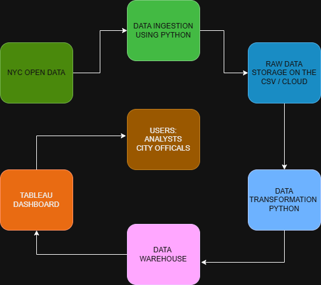
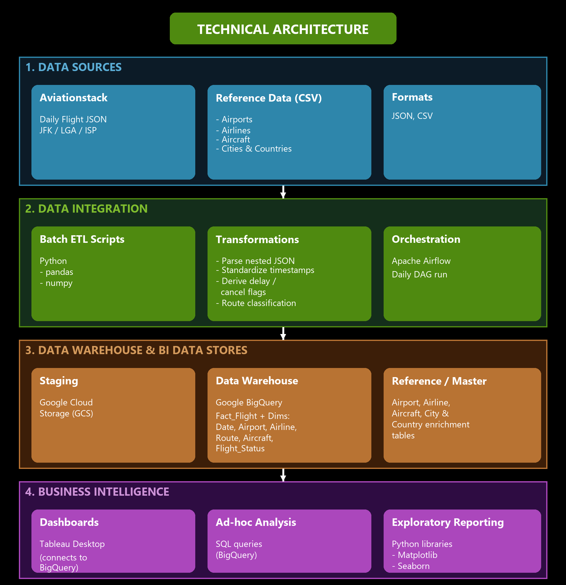
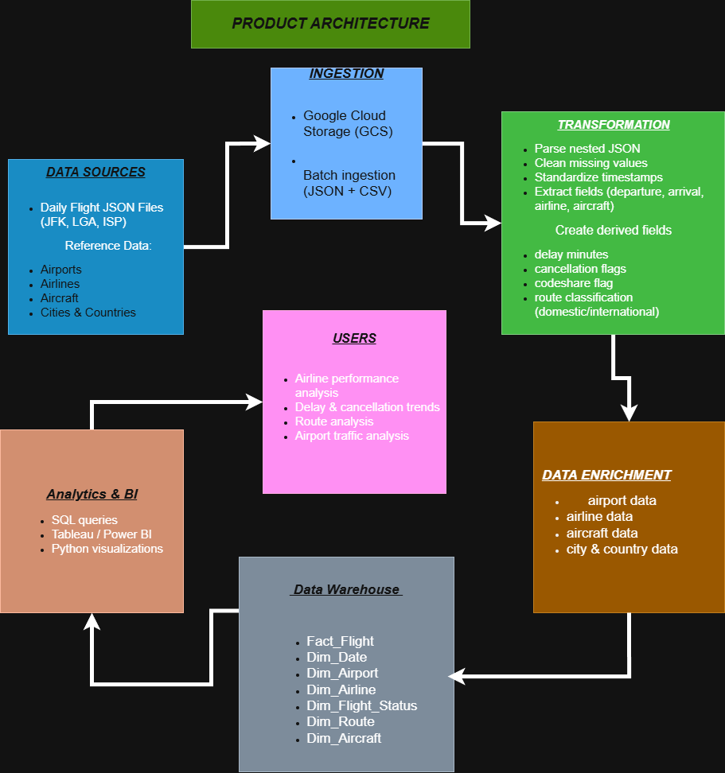

# Project Readme

## A. Problem Context
Aviation is one of the most data-intensive industries, with thousands of flights operating daily across hundreds of airports. Airlines, airport authorities, and regulators need reliable insights into air traffic patterns, flight cancellations, and route distributions to optimize operations, improve customer experience, and reduce costs.

This project focuses on building a data warehouse solution to analyze air traffic data for three major New York area airports: ISP (Long Island MacArthur Airport), JFK (John F. Kennedy International Airport), and LGA (LaGuardia Airport). By analyzing traffic patterns, cancellation trends, and route information, stakeholders can make data-driven decisions to improve airline operations and passenger satisfaction.

## B. Requirements

### 1. Requirements Analysis
- Business Personas
  - List the key stakeholders and their roles.
  - Example:
    - Data Analyst: Responsible for data analysis and reporting.
    - IT Manager: Oversees technical implementation.
- Risks
  - Data quality issues (missing fields, inconsistent formats in the provided dataset).
  - The Aviationstack API is expensive, so the project relies on a professor-provided dataset which may have limited coverage.
  - Cancellation reason data is not included in the dataset; external research is required to infer causes.
  - Team coding experience ranges from beginner to intermediate, which may slow development.
- Costs
  - Estimate the costs associated with the project.
    - Software licenses: $0
    - Real costs: $0
    - The project will utilize open source tools like python, pandas, numpy, and Apache Airflow for ETL, orchestration, and data analysis. Tableau Desktop is free for students through the Tableau for Students program using a Baruch .edu email, so no visualization licensing fees are required.
    - Optional Cost: $0-$70/month
    - In a production-level scenario we could use paid versions such as Tableau Creator at $70 per month, or a managed orchestration service like Google Cloud Composer; these are not needed for this project.
    - Data source costs: $0
    - The flight data is sourced from the Aviationstack database but is provided as a static JSON file by the professor, so there are no API subscription costs for the team. If we were to pull directly from the Aviationstack API instead, the Basic plan would cost about $50 per month for 10,000 requests, but we do not need this.
    - Cloud infrastructure costs: $0
    - The project uses Google Cloud Storage (GCS) for raw and staged data, and Google BigQuery as the data warehouse. Both fit within the GCP free tier for our expected data volume (roughly tens of GB of storage and well under 1 TB of queries per month), so no cloud costs are incurred.
    - Hardware upgrades: $0-$250+
    - If the project is running on a personal computer that meets the 8GB ram and 100gb storage than the costs are free assuming we already have these computers, but hypothetically if we didnt have these we would be looking at a fixed cost of $250 or more if we were to buy a computer for this project.
- Timeline
  - Phase 1: Requirements Gathering, Cost/Benefits/Risks, Architecture — February 28, 2026
  - Phase 2: Data Modeling — March 14, 2026
  - Phase 3: Data Pipeline Started — March 28, 2026
  - Phase 4: Data Pipeline Midway — April 11, 2026
  - Phase 5: Visualization Started — April 25, 2026
- Benefits
  - Identify peak traffic periods (by hour, day, week, month, quarter) for better resource planning.
  - Pinpoint airlines with the highest cancellation rates and suggest actionable improvements.
  - Visualize the most popular flight destinations via heat maps for route optimization.
  - Distinguish domestic vs. international flight volumes to understand airport utilization.

### 2. Business Requirements
- Analyze air traffic patterns of ISP, JFK, and LGA.
- Identify the most frequent flight destinations from each airport.
- Determine whether traffic follows a uniform or normal distribution pattern.
- Analyze domestic flight vs. international flight volumes.

### 3. Functional Requirements
- Track cancelled flights by airline (cancelled vs. non-cancelled).
- Identify the airline with the most cancellations.
- Provide recommendations to reduce flight cancellations.
- Generate traffic pattern reports filterable by hour, day, week, month, and quarter.
- Display a heat map showing the concentration of flight destinations.
- Classify and count domestic vs. international flights.

### 4. Data Requirements
- Structured flight data provided by the professor (sourced from the Aviationstack database).
- Reference data for airports (airport codes, names, locations with latitude/longitude for heat maps).
- External research data on flight cancellation causes (to supplement the dataset, which does not include cancellation reasons).

## C. Architecture

### 1. Information Architecture
- Describe the structure and flow of the information.
- Include diagrams or images if necessary. 
  - 

### 2. Data Architecture
- Describe the structure and flow of the data.
- Include diagrams or images if necessary. 
  - 

### 3. Technical Architecture
- **Data Sources**
  - Daily flight records from the Aviationstack dataset in JSON format for JFK, LGA, and ISP airports
  - Reference data (CSV) for airports, airlines, aircraft, cities, and countries
- **Data Integration**
  - Python-based batch ETL scripts using pandas and numpy for ingestion, cleaning, and transformation (parsing nested JSON, standardizing timestamps, and deriving delay minutes, cancellation flags, codeshare flags, and route classification)
  - Apache Airflow for pipeline orchestration, running the ETL DAG on a daily schedule
- **Data Warehouse and BI Data Stores**
  - Google Cloud Storage (GCS) for raw and staged data
  - Google BigQuery as the relational data warehouse, hosting the dimensional model (Fact_Flight and dimensions for Date, Airport, Airline, Flight_Status, Route, and Aircraft)
  - Reference tables for airport, airline, aircraft, and city/country enrichment data
- **Business Intelligence**
  - SQL (BigQuery) for ad-hoc analysis
  - Interactive dashboards in Tableau Desktop, connected directly to BigQuery
  - Python visualization libraries such as Matplotlib for exploratory reporting
- **Hardware**
  - Developer workstations with 8 GB RAM and 100 GB storage minimum, running ETL scripts locally and connecting to cloud storage for shared staging
- 

### 4. Product Architecture  
- Provide an overview of the product's overall structure.
- Include any major components and how they interact.
- 
## D. Modeling

### 1. Dimensional Modeling
- Explain the dimensional modeling
- Example:
  - **Facts**: describe all the facts
  - **Dimension**: include all dimensions

*Include any necessary images or diagrams to clarify the architecture.*
  - 

### 2. Medallion Architecture
- Explain the medallion architecture and its stages: Bronze, Silver, Gold.
- Example:
  - **Bronze**: Raw, unprocessed data
  - **Silver**: Cleaned and enriched data
  - **Gold**: Aggregated, ready-for-use data

*Include any necessary images or diagrams to clarify the architecture.*
  - 

## E. Methodology and Implementation
Describe the methodology used in the project and the steps followed during implementation.

- Outline the approach taken (e.g., Agile, Waterfall).
- Describe key phases, such as development, testing, deployment.
- Example:
  - Sprint 1: Setup and Data Collection
  - Sprint 2: Data Processing and Model Building
- Metadata Management
  - Data Dictionary
  - Mapping Sources and Target Systems
  - List of all functions
	- Function 1 
	- Function 2
	- Function 3
- ETL Extract Load Transform
- ELT Extract Transform Load
- Tools 

## F. Visualization
Provide details of the visualizations created for the project.

- Include charts, graphs, and any other visual representation of the data.
  - 
- Mention any libraries or tools used for visualization (e.g., Matplotlib, Tableau).

## G. Insights
Highlight any key insights gained from the project.

- Provide an overview of what was learned or discovered through data analysis.
- Example:  
  - High correlation between customer satisfaction and response time.
  - Significant opportunity for cost reduction in supply chain operations.

## H. Conclusion
Summarize the outcomes of the project and any potential next steps.

- What was achieved?
- How can the results be used moving forward?
- Example:
  - The project successfully reduced costs by 20% through process automation.
  - Future work may include expanding the solution to new departments.

## I. References
- Provide a list of all references used in the project, formatted according to MLA style.

1. Author Last Name, First Name. *Title of Book*. Publisher, Year.
2. "Title of Article." *Name of Journal*, vol. 1, no. 1, Year, pp. 1-10.
3. *Title of Website*. Website Publisher, Year, URL.

---

*Replace placeholders like "path_to_image" with actual file paths or URLs.*
